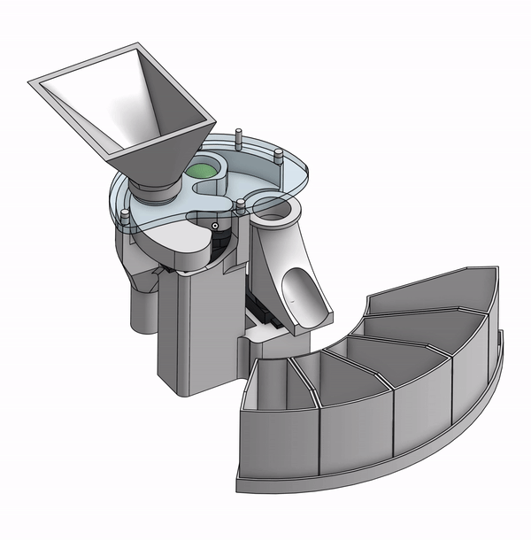
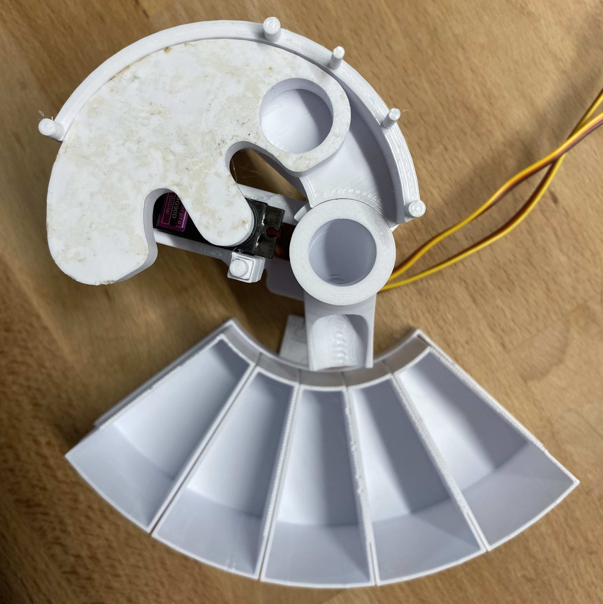
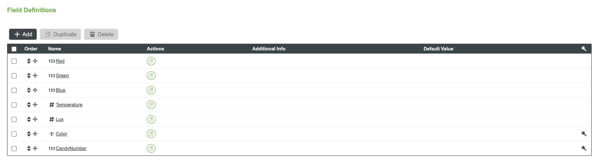
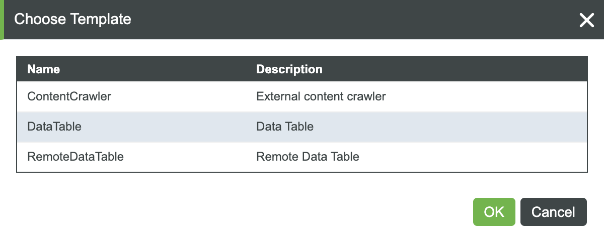
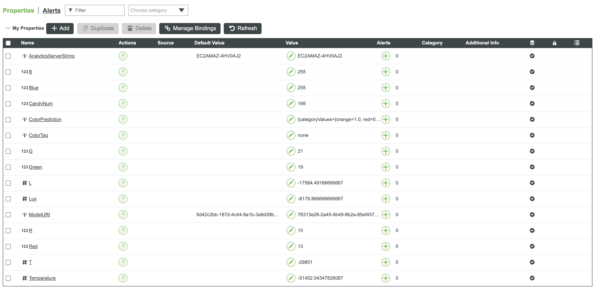
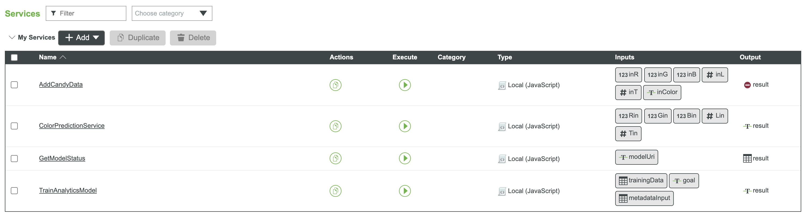

# Candy-Sorter



#### This tutorial shows you how to put together the candy sorting machine found in [this Onshape document](https://cad.onshape.com/documents/9538cae8040bf2539c85bf1f/w/b1f052bee86b8f568c4616e4/e/a4dabf18665eca6b067f7bca)
The original version of the candy sorting machine was made to sort skittles, but the model can be configured to fit any size candy of different color.

### Parts
* [Color sensor option 1 - soldering required, better quality](https://learn.adafruit.com/assets/59109)
* [Color sensor option 2 - no soldering required](https://www.waveshare.com/color-sensor.htm)
* [Servo motor hat option 1 - soldering required](https://www.adafruit.com/product/2327?gclid=CjwKCAjw87SHBhBiEiwAukSeUXhnyrBdVb3wdNFaqTztPAIurUUoyuI3_6jCyiNULFe7ilsiTvhqtRoCTJgQAvD_BwE)
* [Servo motor hat option 2 - no soldering required](https://www.waveshare.com/product/raspberry-pi/hats/servo-driver-hat.htm)
* [Power supply](https://www.adafruit.com/product/276)
* [Raspberry Pi stacking headers (for option 2)](https://www.adafruit.com/product/2223)

## Build Candy Sorting Machine (using AR work instructions)
1. 3D print and laser cut all components 
1. Assmeble the base with motors (do not attach hubs yet)
1. Press fit or hot glue servo hubs into the feeder disk and ramp (do not attach hubs yet)
1. Solder motor shield and sensor, and connect wires


## Set up Raspberry Pi
1. Flash clean image of raspian to an SD card, boot up pi, and connect to internet
1. Connect to pi over vnc (recommended) or headless with ssh
1. Enable I2C pins and remote GPIO control
1. Clone this repo
`
git clone https://github.com/PTC-Education/Candy-Sorter
`
1. Run the following commands from within the CandySorter folder in the terminal on the Raspberry Pi (run `cd CandySorter` from terminal to get into the CandySorter folder on the pi)
```
sudo pip3 install adafruit-circuitpython-servokit
sudo pip3 install adafruit-circuitpython-tcs34725
sudo apt-get install python3-pandas
```

## Test and Calibrate Motors and Sensor
1. Start a python repl from the CandySorter folder by typing python3
```
python3
```
2. Import the candysorter python library
```
>>>import candysorter
```
3. Run the test scripts
```
candysorter.feederServoTest()
candysorter.rampServoTest()
candysorter.sensorTest()
```
and run the settings scripts if things are not working
```
candysorter.setServoNumbers()
candysorter.setThingWorxCreds()
candysorter.setColorPos()
candysorter.setFeederPos()
```
4. Once everything looks good, run the full motor test script. Motors will end at 90 degrees.
```
candysorter.fullServoTest()
```
5. Attach feeder disk to the servo so that the candy hole is lined up with where the sensor goes and the ramp so it is pointing toward the middle color bin.


## Set up ThingWorx Entities and Test REST API Connection
**OPTION 1 - Import DataTable Thing**

1. Download the files named "DataShapes_CandySorterDataShape.xml" and "Things_CandySorter.xml" from this repo, then upload them following [these instructions](https://support.ptc.com/help/thingworx_hc/thingworx_8_hc/en/index.html#page/ThingWorx/Help/Getting_Started/ImportingandExportinginThingWorx/ImportingandExportingDataEntitiesandExtensions.html). You should start by uploading the DataShapes file, then uploading the Things file. You should then see a DataTable Thing in your ThingWorx instance which has the properties and services listed below.
2. 

**OPTION 2 - Create Entities Yourself**

1. Create a new Data Shape with the following field definitions

2. Create a new Data Table Thing with the following template and select the data shape you've just made for the data shape

3. Add the following properties to the data table thing

4. Created four custom services in the data table that are named the same as the .js files in the ["ThingWorx Services" folder](https://github.com/PTC-Education/Candy-Sorter/tree/main/ThingWorx%20Services) in this repo. Make sure you also add the inputs from the screenshot below and specify the data type for the output.

5. Create an AppKey that has permisions to interact with the Data Table thing, then run 


## Calibrate Machine and Train Model
