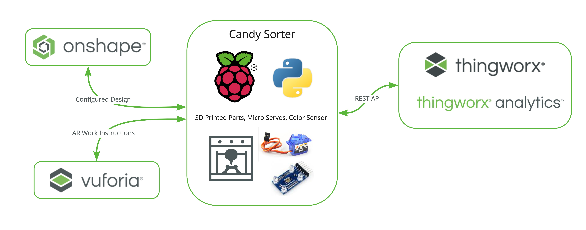
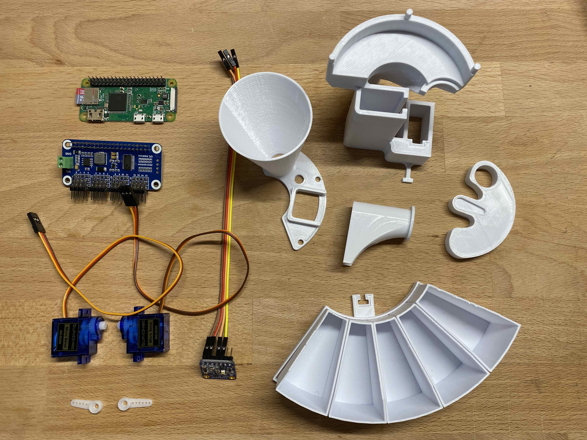

<div class="container"><h2>Candy Sorter</h2>
The goal of this project is to introduce students to the process of designing, building, and analyzing a closed loop manufacturing process. This is a living project and will be updated as new features are added.
</div>

<div class="container">
            <p style="text-align:center"></p>
</div>

<!-- <div class="container">
    <div class="columns is-vcentered is-centered is-multiline ">
        <div class="column width:40%">
            <p style="text-align:center">The candy sorting machine presented in this project is a low-cost, open-sourced design to illustrate a number of ways that the digital transformation technology can add value to a process. You will be shown how the design can be configured to sort a custom candy of your choise in Onshape, then use the latest custom version to assemble the 3D printed parts. Then the machine can be connected to the cloud through python scripts and REST API, storing the data in Onshape and training the machine learning model in ThingWorx. To close the loop, you can add a vision system to the raspberry pi to provide quality control and control the rate of sorting with any online database.</p>
        </div>
        <div class="column is-one-half is-vcentered is-centered">
            <p style="text-align:center"></p>
        </div>
    </div>
</div> -->

<table>
  <tr><th width="50%">
      <p style="text-align:left">The candy sorting machine presented in this project is a low-cost, open-sourced design to illustrate a number of ways that the digital transformation technology can add value to a process. You will be shown how the design can be configured to sort a custom candy of your choise in Onshape, then use the latest custom version to assemble the 3D printed parts. Then the machine can be connected to the cloud through python scripts and REST API, storing the data in Onshape and training the machine learning model in ThingWorx. To close the loop, you can add a vision system to the raspberry pi to provide quality control and control the rate of sorting with any online database.</p>
  </th>
  <th>
      <p style="text-align:center"></p>
    </th></tr>
</table>


#### This tutorial shows you how to put together the candy sorting machine found in [this Onshape document](https://cad.onshape.com/documents/5ba1eb5e5f8ddb831d755d06/w/2c1ffb51df0e9d946adb27b3/e/ee0628979c06ea0d795b6ab4)
The original version of the candy sorting machine was made to sort skittles, but the model can be configured to fit any size candy of different color.

#### Technology Map


<details open><summary><b>Software</b></summary>
<ul>
<li>Onshape</li>
<li>ThingWorx</li>
<li>Vuforia View</li>
</ul>
</details>

#### Parts


<details open><summary><b>Hardware</b></summary>
<ul>
  <li><a href="https://www.raspberrypi.org/">Raspberry Pi</a> (tested with 3B+, Pi Zero W and Pi 4 being tested currently)</li>
<li><a href="https://learn.adafruit.com/assets/59109">Color sensor option 1 - soldering required, better quality</a></li>
<li><a href="https://www.waveshare.com/color-sensor.htm">Color sensor option 2 - no soldering required</a></li>
<li><a href="https://www.adafruit.com/product/2327?gclid=CjwKCAjw87SHBhBiEiwAukSeUXhnyrBdVb3wdNFaqTztPAIurUUoyuI3_6jCyiNULFe7ilsiTvhqtRoCTJgQAvD_BwE">Servo motor hat option 1 - soldering required</a></li>
<li><a href="https://www.waveshare.com/product/raspberry-pi/hats/servo-driver-hat.htm">Servo motor hat option 2 - no soldering required</a></li>
  <li><a href="https://www.adafruit.com/product/276">Power supply</a></li>
<li><a href="https://www.adafruit.com/product/2223">Raspberry Pi stacking headers (for option 2)</a></li>
</ul>
</details>
  
  
<h2> Build Candy Sorting Machine (using AR work instructions)</h2>
<details><summary><b>Building Steps</b></summary>
<br>
  <ol>
<li>3D print and laser cut all components </li>
<li>Assmeble the base with motors (do not attach hubs yet)</li>
<li>Press fit or hot glue servo hubs into the feeder disk and ramp (do not attach hubs yet)</li>
<li>Solder motor shield and sensor, and connect wires</li>
  </ol>
</details>

## Set up Raspberry Pi
<details><summary><b>Set up steps</b></summary>
<ol>
<li>
  
  Flash clean image of raspian to an SD card, boot up pi, and connect to internet. Setup instructions can be found on [this page](https://www.raspberrypi.org/documentation/setup/).
    </li>
<li>Connect to pi over vnc (recommended) or headless with ssh</li>
<li>
  
  Enable I2C pins and remote GPIO control from the "Interfaces" menu after typing `sudo raspi-config`</li>
<li>Clone this repo
  
`
git clone https://github.com/PTC-Education/Candy-Sorter
`
    </li>
<li>
  
  Run the following commands from within the CandySorter folder in the terminal on the Raspberry Pi (run `cd CandySorter` from terminal to get into the CandySorter folder on the pi)
```
sudo pip3 install adafruit-circuitpython-servokit
sudo pip3 install adafruit-circuitpython-tcs34725
sudo apt-get install libatlas-base-dev
sudo apt-get install python3-pandas
```
  </li>
    
  </ol>
  
</details>

## Test and Calibrate Motors and Sensor
<details><summary><b>Steps for testing and calibrating</b></summary>

  <ol>
<li>Start a python repl from the CandySorter folder on your Raspberry Pi by typing python3 into a terminal

`python3`
</li>
<li>Import the candysorter python library
  
`from ThingWorxCandySorter import *`
    </li>

<li>Run the test scripts
  
```
feederServoTest()
rampServoTest()
sensorTest()
```
and run the settings scripts if things are not working
```
setServoNumbers()
setColorPos()
setFeederPos()
```


<li>Once everything looks good, run the full motor test script. Motors will end at 90 degrees.
  
```
fullServoTest()
```

    
<li>Attach feeder disk to the servo so that the candy hole is lined up with where the sensor goes and the ramp so it is pointing toward the middle color bin.<br>
  </li>
</ol>
</details>
  
  
## Set up ThingWorx Entities and Test REST API Connection
<details><summary><b>OPTION 1 - Import DataTable Thing</b></summary>

1. Download the files named "DataShapes_CandySorterDataShape.xml" and "Things_CandySorter.xml" from this repo, then upload them following [these instructions](https://support.ptc.com/help/thingworx_hc/thingworx_8_hc/en/index.html#page/ThingWorx/Help/Getting_Started/ImportingandExportinginThingWorx/ImportingandExportingDataEntitiesandExtensions.html). You should start by uploading the DataShapes file, then uploading the Things file. You should then see a DataTable Thing in your ThingWorx instance which has the properties and services listed below.
2. Create an AppKey that has permisions to interact with the Data Table thing, then run the following script from your python repl
`candysorter.setThingWorxCreds()`
3. Run the following script from the python repl to test the connection to ThingWorx `candysorter.testConnection()` and ensure you see a 200 response status code.

  </details>
  

<details><summary><b>OPTION 2 - Create Entities Yourself</b></summary>

1. Create a new Data Shape with the following field definitions

  
2. Create a new Data Table Thing with the following template and select the data shape you've just made for the data shape

  
3. Add the following properties to the data table thing

  
4. Created four custom services in the data table that are named the same as the .js files in the <a href="https://github.com/PTC-Education/Candy-Sorter/tree/main/ThingWorx%20Services">ThingWorx Services folder</a> in this repo. Make sure you also add the inputs from the screenshot below and specify the data type for the output.

  
5. Create an AppKey that has permisions to interact with the Data Table thing, then run the following script from your python repl
`candysorter.setThingWorxCreds()`
6. Run the following script from the python repl to test the connection to ThingWorx `candysorter.testConnection()` and ensure you see a 200 response status code.

  </details>
  
## Train Model
<details><summary><b>Build data set</b></summary>

* Now you are ready to train your model. From your repl you can now run `mainTraining(5)`. The input parameter to the mainTraining function is the number of times each color input will be added to the data table.
* The repl will ask you to input the color skittle each time. If there is no skittle, you can just click enter and "none" will be added to the 
* Check the mashup of your data table to make sure data is being added.
* Add as many rows as you think the model will need to learn (you can always add more and retrain)
  
  </details>
  
<details><summary><b>Train the model</b></summary>

1. Run `trainModel()` from the repl. 
2. This script will first export the data from your data table into python, then gets rid of any unnecessary columns, then formats as an infotable and sends it to the TrainingThing on the Analytics Server. **Make sure you've set the "AnalyticsServerString" property in ThingWorx to match your analytics string**
3. The script should prompt you to type in the data type and operational type of each of the fields. 
    1. For the Red, Green, and Blue fields, they should be `INTEGER` and `CONTINUOUS`.
    2. The Temperature and Lux fields should be `NUMBER` and `CONTINUOUS`.
    3. The Color field should be `STRING` and `CATEGORICAL`. 
    4. And for the values of the Color field, you should put in the values as an array `["red","green","orange","purple","yellow","none"]`
4. If everything worked well, you should get a Model URI back from ThingWorx, and the ModelURI property in your Data Thing should be updated.
  </details>
  
<details><summary><b>Get Model Status</b></summary>

1. From the repl, run `getModelStatus()`. This service will ask ThingWorx for the model status every 20 seconds until it is complete.


</details>

## Automated Run
<details><summary><b>Run the Candy Sorter with Live Predictions</b></summary>
Once the model has finished training, you are ready to automate the candy sorter with real time predicitons from the ThingWorx Analytics model. The script below will send the sensor values to the model in ThingWorx and get back the prediction as to what color is currently in front of the sensor.
  
  
```
mainAutoSort()
```
  
</details>
